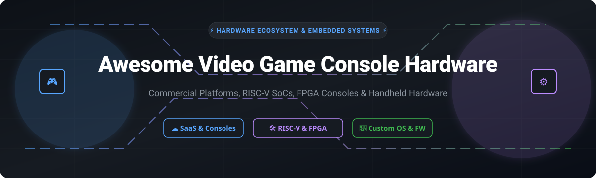

# 🎮 Awesome Video Game Console Hardware

    

> 🚀 **Curated directory of SaaS gaming platforms, commercial console hardware, open-source RISC-V/FPGA gaming projects, and custom retro-gaming firmware.**

A comprehensive guide for retro-gaming enthusiasts, embedded systems engineers, hardware hackers, and preservation advocates exploring both commercial platforms and open-source console architectures.

---

## 📚 Table of Contents
- [🏢 Commercial Consoles & SaaS Platforms](#-commercial-consoles--saas-platforms)
- [🛠️ Open-Source Hardware & Firmware Projects](#%EF%B8%8F-open-source-hardware--firmware-projects)
- [🤝 How to Contribute](#-how-to-contribute)
- [💖 Support](#-support)
- [⚠️ Disclaimer](#%EF%B8%8F-disclaimer)
- [📈 Star History](#-star-history)

---

## 🏢 Commercial Consoles & SaaS Platforms

> 📊 **Market Overview**: The global video game console and cloud gaming hardware sector is estimated at **$200+ Billion** in market size. The market is **highly concentrated** (winner-take-all dynamics dominated by tech giants Microsoft, Sony, Nintendo, and Valve), with immense barriers to entry surrounding custom silicon manufacturing, OS development, and exclusive content rights.

Below is a comparison of major commercial gaming platforms and cloud ecosystem providers, sorted by **Company Size / Valuation (Descending)**:

| Product / Platform 🎮 | Company & Market Size 📈 | Starting Pricing 💰 | Free Tier & Free Trial Limits 🎁 | Key Features & Focus 🌟 |
| :--- | :--- | :--- | :--- | :--- |
| **[Xbox Series X](https://www.xbox.com/consoles/xbox-series-x)** / **[Series S](https://www.xbox.com/consoles/xbox-series-s)** | **Microsoft Corporation** • Market Cap: **$3.1 Trillion** • Revenue: **$245 Billion/yr** | **$299.99 MSRP** (Series S) **$499.99 MSRP** (Series X) | **Free Xbox Network Account**: • Free multiplayer for free-to-play games (e.g., *Fortnite*, *Apex Legends*) • Free Xbox Cloud Gaming access for *Fortnite* without subscription | 12 TFLOPS 4K gaming (Series X) & 1440p digital budget gaming (Series S). Features Quick Resume and backwards compatibility. |
| **[PlayStation 5 Digital](https://www.playstation.com/ps5/)** / **[PS4](https://www.playstation.com/ps4/)** | **Sony Group Corporation** • Market Cap: **$105 Billion** • Revenue: **$88 Billion/yr** | **$299.99 MSRP** (PS4) **$449.99 MSRP** (PS5 Digital) | **Free PlayStation Network Account**: • Free online multiplayer for F2P titles (*Warzone*, *Genshin Impact*) • **14-day Free Trial** for PlayStation Plus Premium tier | High-speed custom NVMe SSD, DualSense haptic feedback, and exclusive PlayStation ecosystem titles. |
| **[Nintendo Switch](https://www.nintendo.com/switch/)** / **[Switch Lite](https://www.nintendo.com/switch/lite/)** | **Nintendo Co., Ltd.** • Market Cap: **$65 Billion** • Revenue: **$11 Billion/yr** | **$199.99 MSRP** (Lite) **$299.99 MSRP** (Standard) | **Free Nintendo Account**: • Free access to F2P titles (*Ninjala*, *Pokémon UNITE*) • **7-day Free Trial** for Nintendo Switch Online subscription | Hybrid TV/handheld console and dedicated portable handheld powered by custom NVIDIA Tegra SoC. |
| **[ASUS ROG Ally](https://rog.asus.com/gaming-handhelds/rog-ally/)** | **ASUSTeK Computer Inc.** • Market Cap: **$15 Billion** • Revenue: **$16 Billion/yr** | **$599.99** (Z1 Model) **$699.99** (Z1 Extreme) | **Bundled 90-day Free Trial**: • Includes 3 full months of Xbox Game Pass Ultimate with cloud gaming access | Windows 11 handheld gaming PC with 120Hz VRR screen and AMD Ryzen Z1 Extreme APU. |
| **[Logitech G Cloud](https://www.logitechg.com/en-us/products/cloud-gaming/g-cloud.940-000177.html)** | **Logitech International S.A.** • Market Cap: **$13 Billion** • Revenue: **$4.3 Billion/yr** | **$349.99 MSRP** | **Bundled 30-day Free Trials**: • 1-month GeForce NOW Priority trial • 1-month Xbox Game Pass Ultimate trial • Free GeForce NOW tier (1-hr sessions) | Lightweight cloud-streaming handheld with 1080p 7-inch display and 12+ hour battery life. |
| **[Steam Deck](https://www.steamdeck.com/)** | **Valve Corporation** • Valuation: **$8 Billion** (Est. Private) • Revenue: **$13 Billion/yr** | **$399.00** (256GB LCD) **$549.00** (512GB OLED) | **Free Steam Account**: • Lifetime free access to 4,000+ free-to-play games (*Counter-Strike 2*, *Dota 2*) • Free cloud save storage | Open Linux-based handheld PC (SteamOS) with custom AMD Aerith/Sephiroth APU and Proton compatibility layer. |
| **[Ayaneo 2](https://www.ayaneo.com/)** | **AYANEO Co., Ltd.** • Valuation: **~$50 Million** (Private SME) • Revenue: **~$25 Million/yr** | **$849.00** (6800U Model) | **30-day Evaluation Mode**: • Ships with Windows 11 Home trial/evaluation mode supporting full local execution | Premium handheld PC featuring AMD Ryzen 7 6800U, borderless glass screen, and hall-effect joysticks. |

---

## 🛠️ Open-Source Hardware & Firmware Projects

The open-source hardware and embedded gaming movement is thriving. Below is a list of top open-source console projects, custom operating systems, and FPGA architectures, sorted by **GitHub Stars (Descending)**:

### 🌟 Open-Source Repository Leaderboard

1. **[OpenEmu/OpenEmu](https://github.com/OpenEmu/OpenEmu)**   
   🍎 *Modular open-source game console emulator designed for macOS.* Native Cocoa interface with core plugins for classic hardware platforms (NES, SNES, Genesis, N64, PS1).

2. **[libretro/RetroArch](https://github.com/libretro/RetroArch)**   
   🕹️ *Reference frontend for the Libretro API.* Cross-platform open-source engine powering emulators, game engines, and media players across microcontrollers, handhelds, and PCs.

3. **[RetroPie/RetroPie-Setup](https://github.com/RetroPie/RetroPie-Setup)**   
   🥧 *Turn Raspberry Pi, ODroid, or PC into a retro-gaming console.* Built upon Raspbian, EmulationStation, and RetroArch with automated system management.

4. **[MiSTer-devel/Main_MiSTer](https://github.com/MiSTer-devel/Main_MiSTer)**   
   ⚙️ *Open-source FPGA gaming platform based on DE10-Nano board.* Cycle-accurate hardware re-creation of classic game consoles, arcade hardware, and home computers.

5. **[batocera-linux/batocera.linux](https://github.com/batocera-linux/batocera.linux)**   
   🐧 *Open-source retro-gaming OS distribution.* Works as a plug-and-play bootable firmware on single-board computers, handhelds, and x86_64 PCs.

6. **[ares-emulator/ares](https://github.com/ares-emulator/ares)**   
   🎯 *Multi-system open-source emulator focused on accuracy and preservation.* Descendant of higan and bsnes supporting 24 classic console systems.

7. **[higan-emu/higan](https://github.com/higan-emu/higan)**   
   👾 *Cycle-accurate multi-system emulator.* Uncompromising focus on exact hardware emulation precision for Famicom, Super Famicom, Game Boy, and Neo Geo Pocket.

8. **[TriForceX/MiyooCFW](https://github.com/TriForceX/MiyooCFW)**   
   📱 *Custom open-source firmware for budget handheld consoles.* Optimized OS for Miyoo, BittBoy, PocketGo, and PowKiddy V90/Q90/Q20 handhelds.

9. **[Wren6991/RISCBoy](https://github.com/Wren6991/RISCBoy)**   
   💎 *Open-source portable games console designed from scratch in Verilog 2005.* Features custom RV32IMC RISC-V CPU, custom hardware graphics pipeline, KiCad PCB layouts, and formal verification targeting iCE40 FPGAs.

10. **[uzebox/uzebox](https://github.com/uzebox/uzebox)**   
    🕹️ *Open-source 8-bit game console design based on AVR ATmega644.* Generates video/audio on-the-fly with custom kernel, SD-card loader, and SNES controller interface.

11. **[clockworkpi/GameShell](https://github.com/clockworkpi/GameShell)**   
    📟 *Modular open-source retro handheld console hardware.* Features Linux OS, modular mainboard, keypad, stereo speakers, and 3D-printable modular shell.

12. **[jncronin/gk](https://github.com/jncronin/gk)**   
    🚀 *Open-source handheld console running custom OS (gkos) on STM32MP2 MPU.* Dual Cortex-A35 + Cortex-M33, 1 GiB LPDDR4, 800×480 screen, and etnaviv GPU hardware acceleration.

13. **[giltal/RetroESP32-P4](https://github.com/giltal/RetroESP32-P4)**   
    ⚡ *Bare-metal retro-gaming platform on dual-core RISC-V ESP32-P4.* Runs 15 emulators (SNES, Genesis, NeoGeo at 60 FPS) without Linux or GPU dependencies.

14. **[REG-Linux/REG-Linux](https://github.com/REG-Linux/REG-Linux)**   
    📦 *Immutable open-source retro-gaming OS.* Built on systemd-free Buildroot for ARM, AArch64, RISC-V 64-bit, and x86_64 single-board computers and handhelds.

15. **[ry755/ushell](https://github.com/ry755/ushell)**   
    💻 *Desktop OS environment shell for Uzebox console.* Enables window management and application launching directly on 8-bit microcontrollers.

16. **[andkorzh/FPGA-DENDY-SE](https://github.com/andkorzh/FPGA-DENDY-SE)**   
    🔴 *Cycle-accurate FPGA implementation of 8-bit console hardware.* Written for Cyclone I FPGA with composite video out and PWM sound synthesis.

17. **[wueHans RISC-V Console Architecture](https://preview.riscv-europe.org/summit/2026/media/proceedings/2026-06-11-RISC-V-Summit-Europe-17h15-HAGER-slides.pdf)**  
    🎓 *Fully open-source RISC-V gaming console and SoC architecture from University of Würzburg.* Built on ULX3S FPGA with custom 2D GPU, 8-channel APU, VexRiscv CPU, LLVM toolchain, and custom 3D printed housing.

---

## 🤝 How to Contribute

We welcome community contributions! To add or update an entry:

1. 🍴 **Fork** this repository.
2. 📝 **Edit `README.md`** following the structured tabular & stargazers badge format.
3. ⚡ Ensure all links, pricing details, free tier limits, and star badges are accurate.
4. 📬 Submit a **Pull Request** with a summary of your changes.

---

## 💖 Support & Sponsorship

Thank you for visiting and supporting open-source gaming hardware projects! If you find this curated list valuable, please consider supporting the project:

- ⭐ **Star** this repository to help others discover it!
- 🍴 **Fork** it to keep your own reference copy.
- 📢 **Share** it with fellow hardware hackers, retro gamers, and FPGA developers.
- ☕ **Sponsor / Buy me a coffee**: If you'd like to support ongoing open-source research and documentation, feel free to sponsor via the [GitHub Sponsor Dashboard](https://github.com/sponsors/ishandutta2007).

---

## ⚠️ Disclaimer

- **Community Curated**: This repository is a community-maintained resource list and does not constitute an endorsement.
- **Hardware Engineering**: Open-source hardware projects require expertise in FPGA programming (Verilog/VHDL), PCB design (KiCad), and embedded system development.
- **Intellectual Property**: Commercial video game hardware, trademarks, and BIOS files are proprietary property of their respective owners.

---

## 📈 Star History

---

  <b>Built with ❤️ for Retro Gamers, FPGA Engineers, and Open Hardware Advocates.</b>

